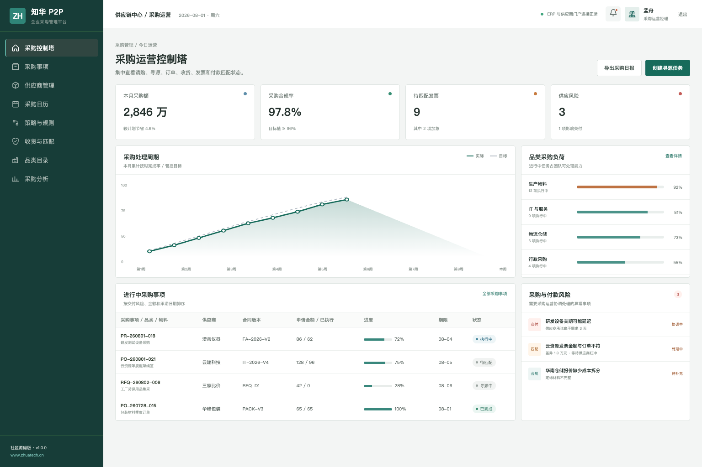
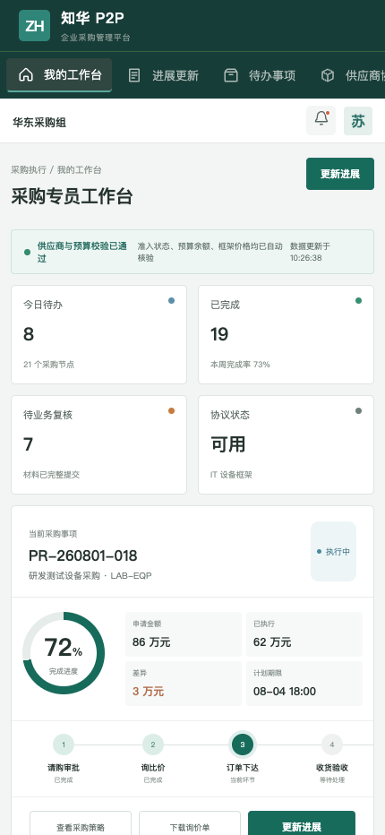

# 企业采购，从需求到付款形成一条可信链路

## ZhuaTech P2P · Procure to Pay

ZhuaTech P2P 是知华科技（上海如静知华信息科技有限公司）的企业采购管理社区源码版，覆盖请购、审批、寻源、订单、收货、发票和付款匹配。官网：[https://www.zhuatech.cn/](https://www.zhuatech.cn/)

### 采购管理端

采购运营人员可以追踪采购金额、节省率、执行周期、协议覆盖、三单匹配和供应风险。



### 采购专员 H5 端

移动工作台支持询比价、供应商沟通、订单进展、收货差异和风险反馈。



### 功能范围

1. 采购申请、预算校验、审批矩阵与授权控制。
2. RFQ/RFP、供应商报价、比价定标与过程留痕。
3. 框架协议、采购目录、价格有效期和订单执行。
4. 收货验收、服务确认、发票校验与三单匹配。
5. 采购节省、周期、合规率和供应商风险分析。

系统中的供应商、金额和业务记录均为虚构演示数据。

### 三单匹配预审

新增 `POST /api/admin/three-way-match`，比对采购订单、收货和发票金额，并检查数量差异、价格差异、重复发票与税务有效性，返回差异率、`AUTO_APPROVE / REVIEW / BLOCK` 结论和原因，帮助应付团队提前分流异常单据。

### 技术与运行

后端使用 Java 21、Spring Boot、Security、JWT、JPA、Flyway；前端使用 Vue 3、Pinia、Vue Router、Axios、Vite；数据库使用 MySQL 8，并提供 H2 集成测试与 Docker Compose。

工程包名 `cn.zhuatech.p2p`，数据库 `zhuatech_p2p`。

```bash
cd frontend
npm install
npm run dev:demo
```

访问 `http://localhost:5173`；管理端 `planner / Demo@2026`，执行端 `operator / Demo@2026`。生产式体验可执行 `cp .env.example .env && docker compose up --build`。

### 授权声明

本项目仅能用于个人学习、研究和非商业交流，**不得商用**。生产使用、内部经营、SaaS 服务、客户交付、二次销售、收费培训、咨询实施或品牌替换，需要上海如静知华信息科技有限公司书面授权。详见 [LICENSE](LICENSE)。

需要采购数字化、SRM/ERP/财务系统集成、私有化部署或深度定制，请访问[知华科技官网](https://www.zhuatech.cn/)或添加微信：

| 商务咨询 | 技术咨询 |
| --- | --- |
|  |  |

[架构说明](docs/architecture.md) · [接口说明](docs/api.md) · [数据库设计](docs/database.md) · [参与贡献](CONTRIBUTING.md)

SEO：P2P 采购系统、采购管理系统源码、请购管理、供应商寻源、三单匹配、Java 采购系统、Vue 采购平台、知华科技。
